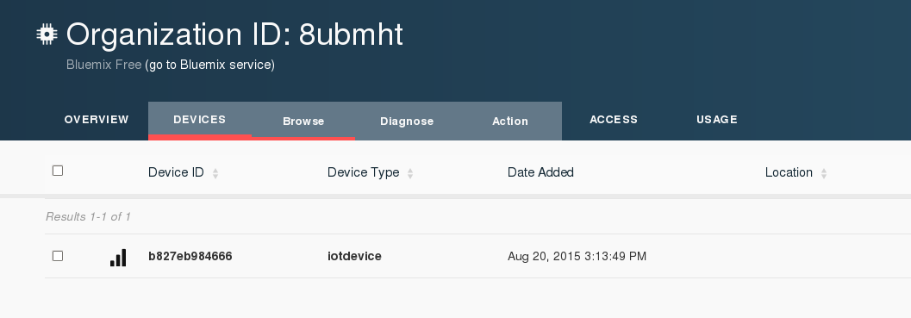

Turning LED on and OFF based on simulated temperature received from the Raspberry Pi.
====================================================================================
Code for both Device and Application is stored here.

Device wil send a simulated temperature data to Bluemix Dashboard.

Bluemix Dashboard will retain the data ( can be seen thru visualization)

Node.js Application on my laptop will wait for data from Device.

If Device sends a simulated temperature of > 10 - then application will send back a "Critical" message to Device.  

If Device sends a simulated temperature of < 10 - then application will send back a "safe" message to Device.

Device code can be got from RPIDatagenerator in my repository.  
Device is configured to Pin 11 - to turn a LED on / off.

e.g: C code =  pinMode(PIN11,OUTPUT);

Application code is in Node.js, and to run it - execute it as in the folder where you extract the Node.js code,  
./node app.js 

A sample run would show it as :
[@oc0650888602 nodetest]$ node app.js
 The device Type is iotdevice Device id = b827eb984666
[2015-10-09 18:27:35.606] [INFO] [default] - Connected to IoTF successfully
Device status from :: iotdevice : b827eb984666 with payload : { "Action": "Connect", "Time": "2015-10-09T11:39:46.232Z", "ClientAddr": "124.40.244.199", "ClientID": "d:8ubmht:iotdevice:b827eb984666", "Port": 1883, "SecureConnection": false, "Protocol": "mqtt-tcp", "User": "use-token-auth", "ConnectTime": "2015-10-09T11:39:46.140Z" }
Device Event from :: iotdevice : b827eb984666 of event status with payload : {"d" : {"temp" : 5 }}
temperature is 5
since temp is < 10, SAFE
sending payload safe
Device Event from :: iotdevice : b827eb984666 of event status with payload : {"d" : {"temp" : 7 }}
temperature is 7
since temp is < 10, SAFE
sending payload safe

Snapshot showing that Bluemix IoT application is receving data.

